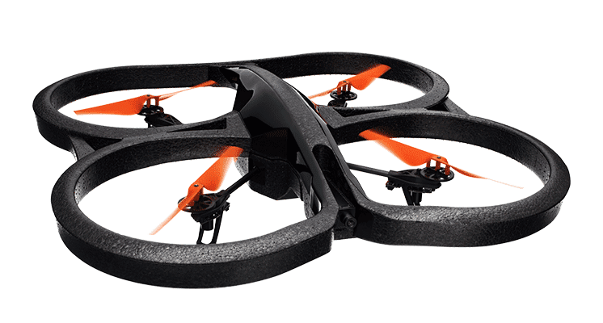
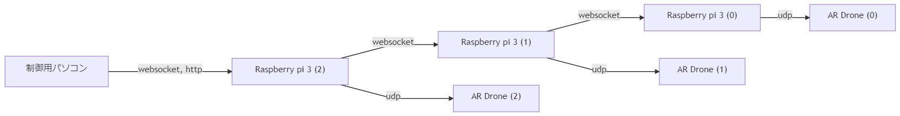
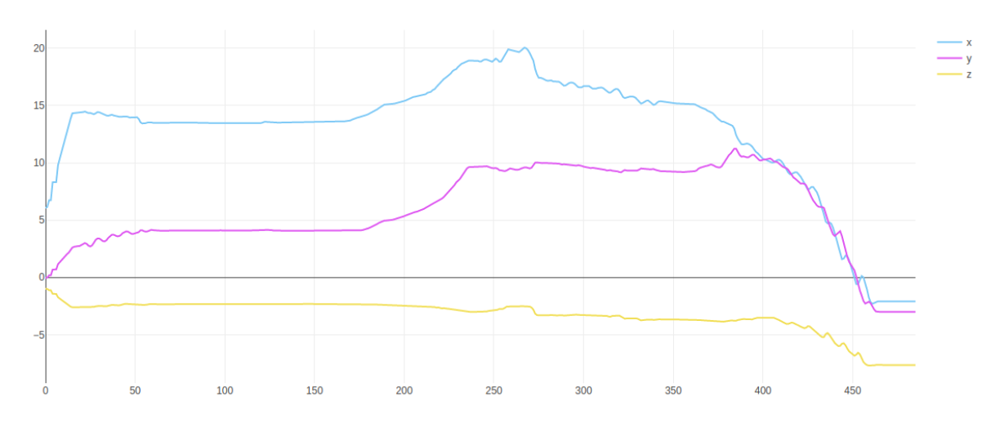

卒業研究 最終報告 1/31(金)
===
坂本惇一郎

---
#### 目次
1. はじめに
2. 研究概要
   1. ドローン
   2. マルチホップ通信
   3. センサデータ
   4. デッドレコニング
   5. 位置制御
1. 実験結果
   1. デッドレコニング
   2. 位置制御
2. まとめ,考察

---
## はじめに
　先行研究ではマルチホップ通信を用いたドローンの制御を行うことでより広範囲のドローンに対して制御命令を送ることができていた．今研究では更に群ドローン制御を実用に耐えうるものにするために，デッドレコニングを用いて求めたそれぞれのドローンの位置情報をもとにより細分化された制御ができるようにする．今回は先頭ドローンの初期位置からの移動量を後続のドローンに共有することで先頭ドローンの動きを後続ドローンで再現することを目指す．

---
## 研究概要
#### ドローン (1) 
今回の研究で使用するParrot社製「AR.Drone 2.0」


---
## 研究概要 
#### ドローン(2)
本研究ではプログラムでの制御のしやすさや，実際に制御時の安定感からParrot社製の「AR.Drone 2.0」を使用する. 実際に使用するドローンのイメージを以下、図1に示す．加速度センサやGPSなどのセンサが内蔵されている．また内部ではLinuxのサーバーがセンサデータの収集や制御用のAPIを提供している．通信する方法はBluetoothとWi-Fiの二つがサポートされている．Wi-Fiを利用した制御では，プログラムからUDPで接続することでAPIにアクセスできる．SDKはnode.jsとpythonで書かれているものがメジャーであり，実際に動作することを確認した．バッテリーは一台当たり15分ほど持続して使用することができる．

---
## 研究概要
#### マルチホップ通信 (1)
マルチホップ通信とは，複数の端末がリレー方式でデータを中継ぎしながら通信する方式であり，これによって，山間部など直接では電波が届きにくい距離の端末と通信をすることができるようになる

---
## 研究概要
#### マルチホップ通信 (2)
今回の実験での全体の構成図
Raspberry Piをアクセスポイントとして設定し，後続のRaspberry Piを接続することでマルチホップ通信を実現する. AR.Drone2.0とRaspberry pi3間の通信はUDP通信、Raspberry pi3同士間での通信は双方向通信が可能なwebsocketを用いた．


---
## 研究概要
#### マルチホップ通信 (3)
今回はRaspberry piのAP化にhostapd, dhcpにdnsmasqを使用した。

---
## 研究概要
#### センサデータ (1)
今回使用するドローンはUDP通信を通してAPIにアクセスすることで，バッテリーの残量や，加速度センサ，ジャイロセンサなどの値にアクセスすることができる. AR.Drone 2.0との通信クライアントはサードパーティー制のOSSであるnode-ar-droneを使用した.

---
## 研究概要
#### センサデータ (2)
以下に実際にAR.Drone 2.0からセンサデータを取得するコードを記述する. このようにセンサデータの取得がコールバック関数によって実行できるため今回はpythonではなくnodejsを採用した.
```
var arDrone = require(‘ar-drone’);

var client = arDrone.createClient();

client.on(‘navdata’, (navdata)=>{
    console.log(navdata);
    // ここでnavdataを用いてドローンの初期位置からの変位を計算する.
}
```

---
## 研究概要
#### デッドレコニング (1)
センサデータから取得できる速度の値はローカル座標でため姿勢角を用いてグローバル座標に変換する必要がある。以下に回転行列を用いた座標系の変換について解説する。

$x,y,z$をそれぞれ ${\rm roll, pitch , yaw}$分回転させる行列 : $Rx, Ry, Rz$
ローカル座標 $~:~p$
グローバル座標 $~:~p{\prime}$

$p^{\prime}= R_z \cdot R_y \cdot R_x \cdot p$


---
## 研究概要
#### デッドレコニング (2)

微小時間: $dt$
速度: $vx, vy, vz$
回転行列 : $R_X, R_y,  R_z$
グローバル座標での移動量: $p$

$
p= (R_z \cdot R_y \cdot R_x)^{-1} \cdot \begin{bmatrix} vx\cdot dt \\ vy\cdot dt \\ vz\cdot dt  \end{bmatrix}$

---
## 研究概要
#### 位置制御
　今回は先頭ドローンの移動量の変化を後続のドローンが再現できることを目指す.このとき,まずそれぞれのRaspberry piは対応するドローンからセンサデータを取得する度の位置を計算する.さらに一定時間ごとに,マルチホップ通信を行うことで先頭ドローンの位置情報を取得し現在のドローンの位置情報との比較を行い差分を調整するための制御命令をドローンに対して送信する.

---
## 実験結果
#### デッドレコニング
デッドレコニングによって実際に取得した初期位置からの変化量を図4に示す.縦軸がメートル, 横軸がセンサデータの取得回数,青,赤,黄の軸がそれぞれx, y, z軸を示している.



---
## 実験結果
#### 位置制御

先頭ドローンの移動量の変化を後続のドローンが再現する動画挿入予定

---

### まとめ,考察

センサデータには一定のノイズが乗っていたためにドローンが動かしていないときに変位が増加することや姿勢角が変化するなどの問題があった。
しかし、実験結果で示すように実際にセンサデータを用いて初期位置からの変化量を計算することができた。

---

#### 参考文献
[1] 澁田叡知,マルチホップ通信による群ドローン制御の研究,H28年度東京工業高等専門学校情報工学科卒業論文,2017.2
[2]AR.DRONE 2.0 POWER EDITION, https://www.parrot.com/jp/doron/parrot-ardrone-20-power-edition (参照 2019/6/28)
[3] node-ar-drone, https://github.com/felixge/node-ar-drone (参照 2019/7/5)
[4] hostapd https://w1.fi/hostapd/ (参照 2020/1/29)
[5] dnsmasq https://web.chaperone.jp/w/index.php?dnsmasq (参照 2020/1/29)